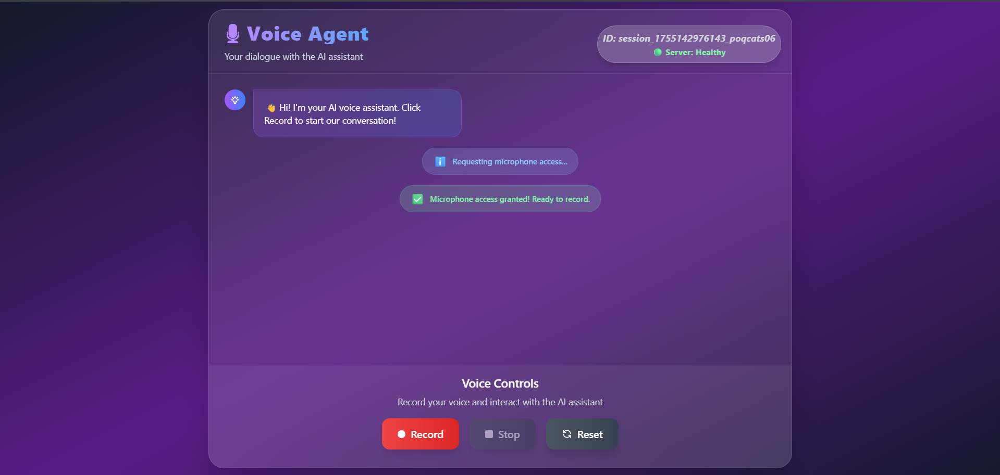
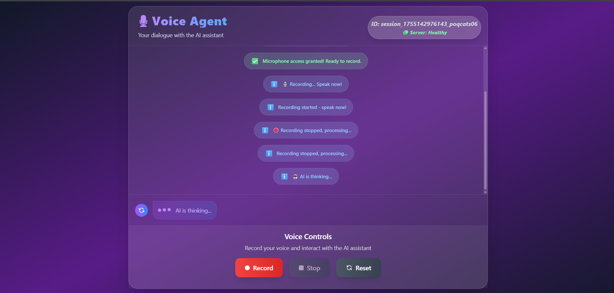
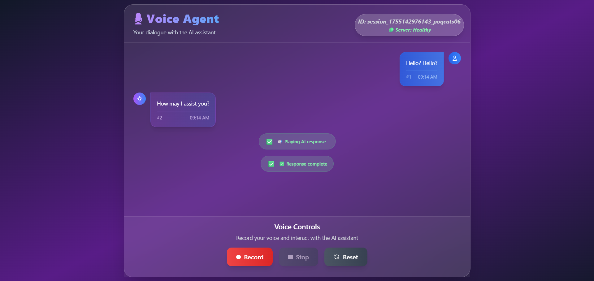
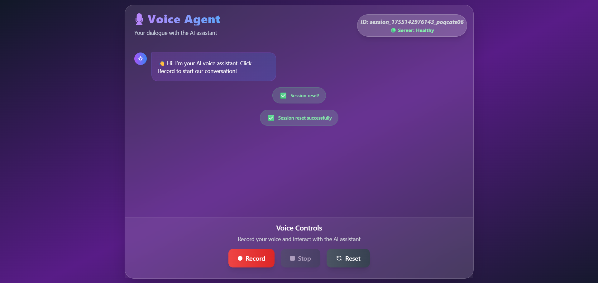

# 🎙️ Voice Agent - AI-Powered Speech-to-Speech Platform

A professional, real-time speech-to-speech interaction platform built with FastAPI that enables natural voice conversations with AI through a complete pipeline: Speech-to-Text → LLM Processing → Text-to-Speech.

## 📸 Screenshots

_Main Interface_


_AI Conversation_



_Reset_


## 🌟 Core Features

### Speech-to-Speech Pipeline

-   **🎤 Voice Input** - Real-time browser audio capture with WebAudio API
-   **📝 Speech-to-Text** - High-accuracy transcription via AssemblyAI
-   **🤖 AI Processing** - Intelligent responses using Google Gemini AI
-   **🔊 Text-to-Speech** - Natural voice synthesis with Murf AI
-   **🎧 Audio Output** - Seamless playback in browser

### Advanced Capabilities

-   **💬 Conversational Memory** - Maintains context across conversation turns
-   **📱 Responsive UI** - Works perfectly on desktop and mobile devices
-   **🔄 Session Management** - Persistent conversations with unique session IDs
-   **⚡ Real-time Processing** - Optimized pipeline for low-latency responses
-   **🛡️ Robust Error Handling** - Graceful fallbacks when services are unavailable

## 🏗️ Architecture

### Modular Design

```
┌─────────────┐    ┌──────────────┐    ┌─────────────────┐
│   Browser   │────│   FastAPI    │────│   AI Services   │
│  (WebAudio) │    │   Backend    │    │   (STT/LLM/TTS) │
└─────────────┘    └──────────────┘    └─────────────────┘
       │                   │                      │
       ▼                   ▼                      ▼
   Audio Input  ────>  Processing  ────>   Audio Output
```

### Speech-to-Speech Workflow

1. **🎤 Capture** → User records voice through browser
2. **📤 Upload** → Audio sent to FastAPI backend via `/agent/chat/{session_id}`
3. **📝 Transcribe** → AssemblyAI converts speech to text
4. **🧠 Process** → Gemini AI generates intelligent response with conversation context
5. **🔊 Synthesize** → Murf AI converts response to natural speech
6. **🎧 Playback** → Audio response streamed back to browser

## 🛠️ Technology Stack

### Backend Architecture

-   **FastAPI 2.0** - Modern async web framework with automatic API documentation
-   **Uvicorn** - High-performance ASGI server
-   **Python 3.12+** - Latest Python with enhanced performance
-   **Pydantic** - Data validation and serialization

### AI & Audio Services

-   **AssemblyAI** - Enterprise-grade speech-to-text transcription
-   **Google Gemini 1.5 Flash** - Advanced language model for conversations
-   **Murf AI** - Professional text-to-speech synthesis
-   **Session Management** - In-memory conversation state management

### Frontend Technology

-   **Tailwind CSS** - Modern utility-first styling framework
-   **Vanilla JavaScript** - WebAudio API integration for recording/playback
-   **Responsive Design** - Mobile-first approach with smooth animations

## 📁 Project Structure

```
FastAPI/
├── 📄 main.py                            # FastAPI application entry point
├── 📁 app/                               # Main application package
│   ├── 📁 api/                           # API endpoint modules
│   │   ├── 📄 agent.py                   # Speech-to-speech chat endpoints
│   │   ├── 📄 health.py                  # System health monitoring
│   │   └── 📄 legacy.py                  # Backward compatibility
│   ├── 📁 core/                          # Core functionality
│   │   ├── 📄 logging.py                 # Logging configuration
│   │   └── 📄 config.py                  # Environment configuration
│   ├── 📁 models/                        # Data models
│   │   └── 📄 schemas.py                 # Pydantic request/response models
│   └── 📁 services/                      # Business logic services
│       ├── 📄 stt_service.py             # Speech-to-Text service
│       ├── 📄 llm_service.py             # Language model service
│       ├── 📄 tts_service.py             # Text-to-Speech service
│       ├── 📄 session_service.py         # Conversation management
│       └── 📄 health_service.py          # System monitoring
├── 📁 templates/                         # HTML templates
│   └── 📄 index.html                     # Main web interface
├── 📁 static/                            # Frontend assets
│   ├── 📄 script.js                      # Application JavaScript
│   └── 📄 styles.css                     # Additional styling
└── 📄 requirements.txt                   # Python dependencies
```

## 🚀 Quick Start

### Prerequisites

-   Python 3.12 or higher
-   Valid API keys for all services

### Installation

```bash
# Clone the repository
git clone https://github.com/HsAhRaSrHmIaT/FastAPI-Murf.git
cd FastAPI

# Install dependencies
pip install -r requirements.txt
```

### Environment Setup

Create a `.env` file in the root directory:

```env
# Required API Keys
GOOGLE_API_KEY=your_gemini_api_key_here
MURF_API_KEY=your_murf_api_key_here
MURF_API_URL=your_murf_api_url_here
ASSEMBLYAI_API_KEY=your_assemblyai_api_key_here
```

### Run the Application

```bash
# Start the development server
python main.py

# Or use uvicorn directly
uvicorn main:app --reload --host 0.0.0.0 --port 8000
```

Visit `http://localhost:8000` to start your voice conversations! 🎙️

## 🔧 API Endpoints

### Core Speech-to-Speech

| Endpoint                           | Method | Description                        |
| ---------------------------------- | ------ | ---------------------------------- |
| `/`                                | GET    | Main web interface                 |
| `/agent/chat/{session_id}`         | POST   | Complete speech-to-speech pipeline |
| `/agent/chat/{session_id}/history` | GET    | Get conversation history           |
| `/agent/chat/{session_id}`         | DELETE | Clear conversation history         |

### System Monitoring

| Endpoint              | Method | Description                   |
| --------------------- | ------ | ----------------------------- |
| `/health/`            | GET    | System health status          |
| `/health/test-errors` | GET    | Test error scenarios          |
| `/docs`               | GET    | Interactive API documentation |

### Legacy Support

| Endpoint           | Method | Description         |
| ------------------ | ------ | ------------------- |
| `/generate-speech` | POST   | Text-to-speech only |
| `/upload`          | POST   | Speech-to-text only |
| `/llm/query`       | POST   | LLM processing only |

## 🎯 Key Features Deep Dive

### Conversation Intelligence

-   **Context Awareness** - Maintains conversation history for natural flow
-   **Error Recovery** - Continues conversation even if individual services fail
-   **Session Isolation** - Multiple users can have independent conversations

### Audio Processing

-   **High-Quality Recording** - WebAudio API with noise suppression
-   **Multiple Formats** - Supports WAV, MP3, WebM, OGG, MP4
-   **Optimized Pipeline** - Efficient audio processing and streaming

### User Experience

-   **Real-time Feedback** - Visual indicators for recording, processing, and playback
-   **Responsive Design** - Seamless experience across all devices
-   **Accessibility** - Keyboard navigation and screen reader support

## 🔧 Service Architecture

### STT Service (`stt_service.py`)

-   Handles audio file processing and transcription
-   Integrates with AssemblyAI for accurate speech recognition
-   Supports multiple audio formats with automatic conversion

### LLM Service (`llm_service.py`)

-   Manages conversation context and AI responses
-   Integrates with Google Gemini 1.5 Flash model
-   Implements conversation memory for natural interactions

### TTS Service (`tts_service.py`)

-   Converts text responses to natural speech
-   Integrates with Murf AI for high-quality voice synthesis
-   Handles audio streaming and format optimization

### Session Service (`session_service.py`)

-   Manages conversation state across requests
-   Implements in-memory session storage
-   Provides conversation history and cleanup

### Health Service (`health_service.py`)

-   Monitors all external service availability
-   Provides detailed health status reporting
-   Enables graceful degradation on service failures

## 🤝 Contributing

1. Fork the repository
2. Create a feature branch: `git checkout -b feature/amazing-feature`
3. Make your changes with proper testing
4. Commit: `git commit -m 'Add amazing feature'`
5. Push: `git push origin feature/amazing-feature`
6. Open a Pull Request


---

**Built with modern AI services and web technologies for seamless voice interactions**

_Refactored Architecture - Production Ready_ 🚀
